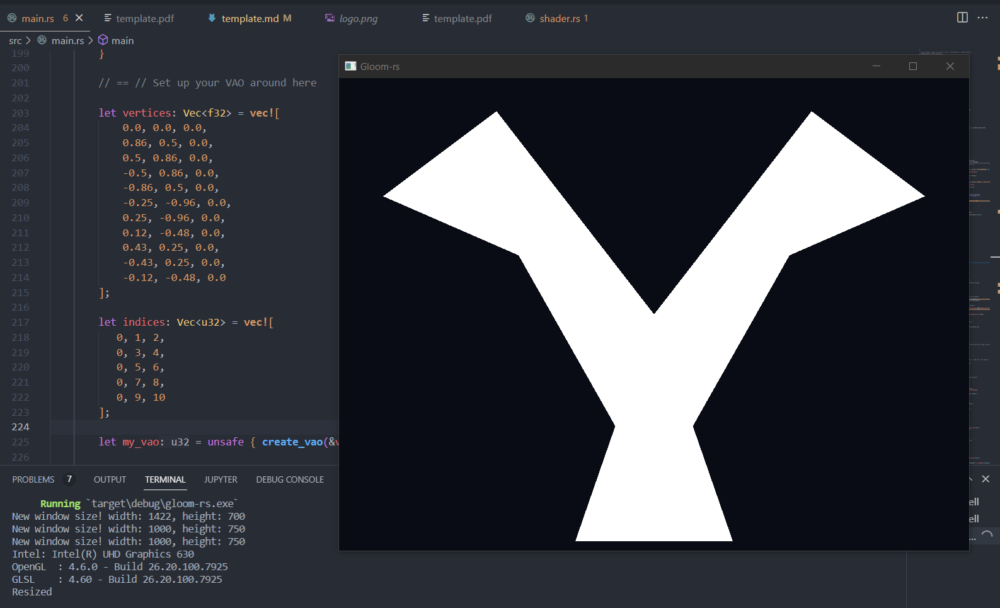
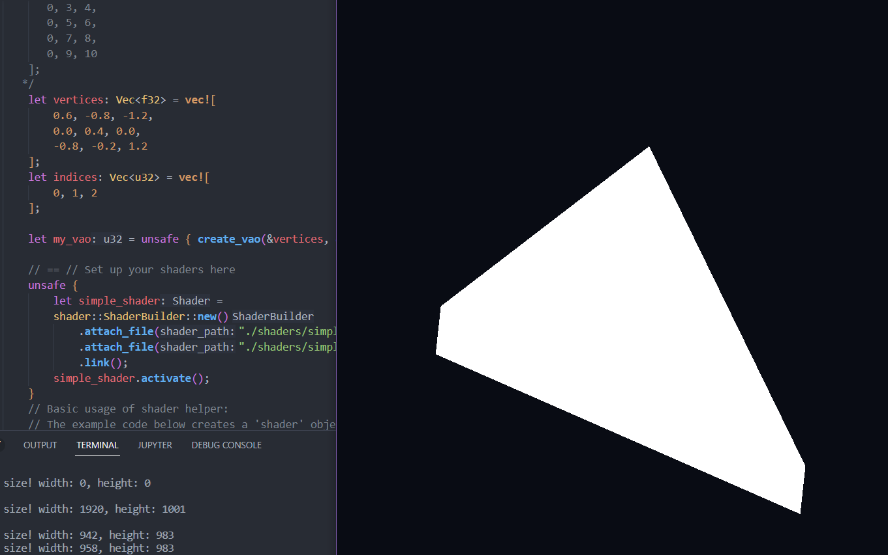
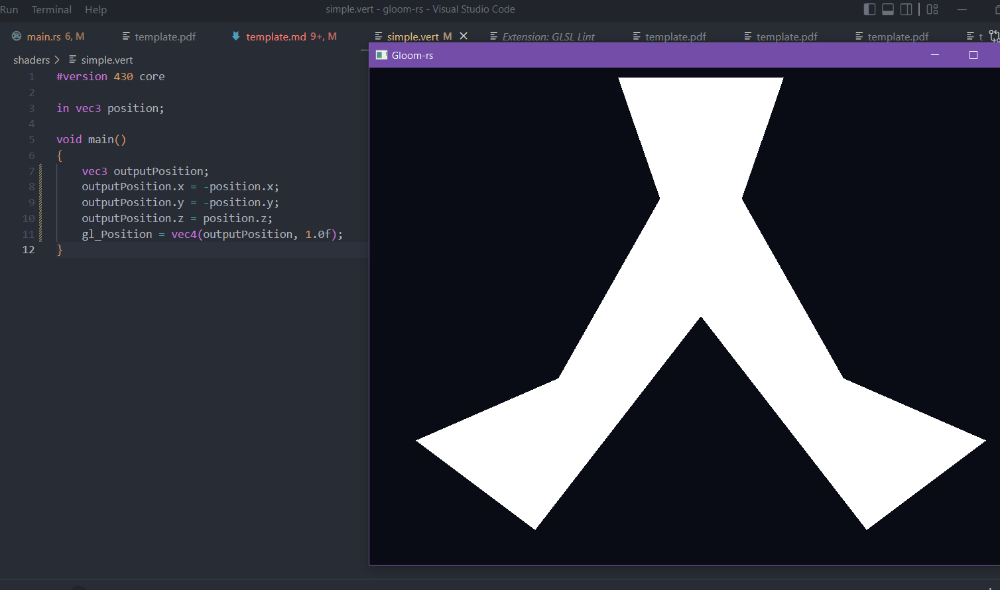
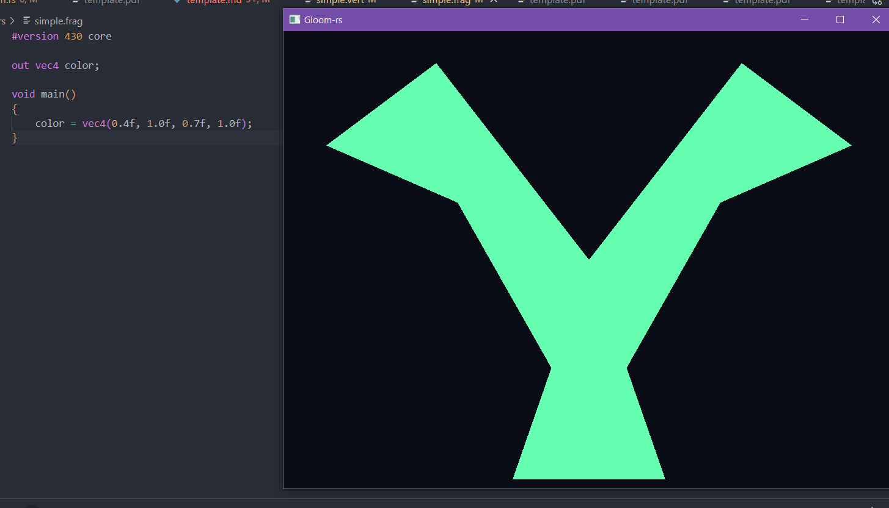
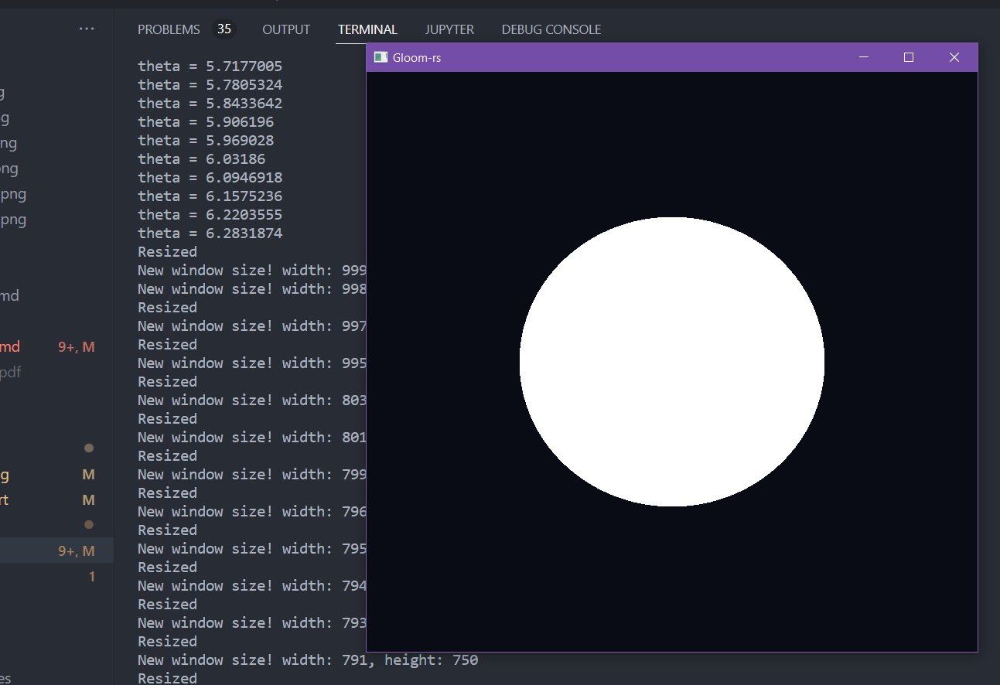
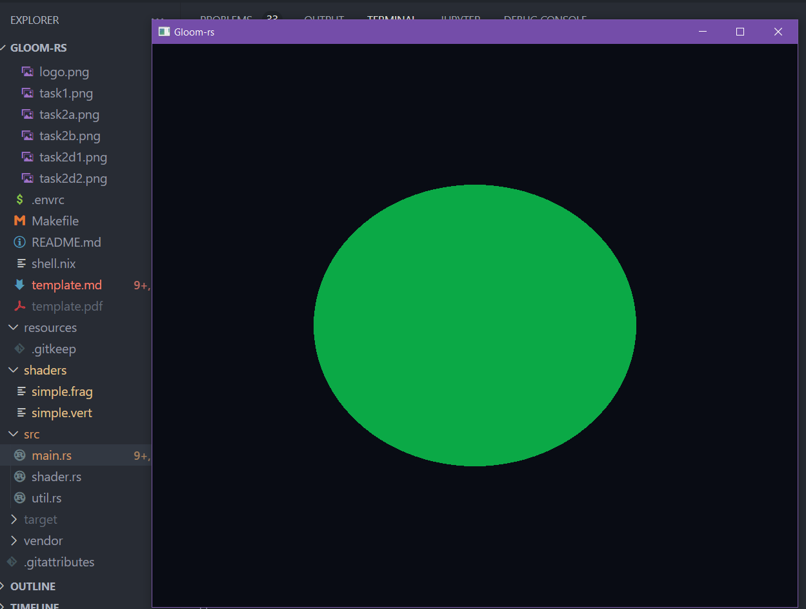

---
# This is a YAML preamble, defining pandoc meta-variables.
# Reference: https://pandoc.org/MANUAL.html#variables
# Change them as you see fit.
title: TDT4195 Exercise 1
author:
- Pablo Díaz Viñambres
date: \today # This is a latex command, ignored for HTML output
lang: en-US
papersize: a4
geometry: margin=4cm
toc: false
toc-title: "Table of Contents"
toc-depth: 2
numbersections: true
header-includes:
# The `atkinson` font, requires 'texlive-fontsextra' on arch or the 'atkinson' CTAN package
# Uncomment this line to enable:
#- '`\usepackage[sfdefault]{atkinson}`{=latex}'
colorlinks: true
links-as-notes: true
# The document is following this break is written using "Markdown" syntax
---

<!--
This is a HTML-style comment, not visible in the final PDF.
-->

# Task 1: Basic triangle composition

For task 1, exercise c), we arranged a composition of 5 triangles roughly making an 'Y' shape. In order to reduce memory consumption, We reused the central vertex at (0, 0, 0) for all the triangles using the Vertex Index Buffer. The coordinates and indexing of the vertices are also included in the screenshot. 

# Task 2: Geometry and theory
## Exercise a)
When we draw the triangle we get a pentagon shape instead of a triangle. This happens because of camera clipping. We can recall that in OpenGL, the camera faces the negative Z axis by default. In this case, one of the vertices of the triangle has a positive Z value (+1.2), making it being placed behind the camera. Because of this, OpenGL clips the part of the triangle that ends outside of the camera field of view. 

The purpose of this mechanism is to reduce the amount of pixels that need to be drawn. Since pixels behind the camera won't have valid device coordinates and won't be visible, we save the effort of drawing them by clipping them beforehand.

## Exercise b)
Let's start with the 5 triangle figure shown in Task 1. If we, for instance, change the order vertex of the second triangle from 0 -> 3 -> 4 to 0 -> 4 -> 3 the triangle disappears. What happened is that we changed the "winding direction" of the triangle. By default, triangles with vertices specified in counter-clockwise order are interpreted by OpenGL as front-facing. By changing the vertex order to clockwise, the triangle will be back-facing. Therefore, because of the mechanism known as backface calling, the triangle will not be drawn. This mechanism is used to reduce the number of polygons that need to be drawn, since backfacing polygons are usually behind the front part of a solid model and hence not visible.

## Exercise c)

*Why does the depth buffer need to be reset each frame?*

The depth buffer is used to find which objects are in front of others. If an object A on Frame X is in front of object B on pixel P, the Z-buffer algorithm will only draw A on that pixel (assuming A is not transparent). Now let's say that object A disappears on frame X+1. If we didn't reset the depth buffer beforehand, object B still won't be drawn on pixel P, since its z-value on that pixel is still less than the old z-value from object A in frame X.

*In which situation can the Fragment Shader be executed multiple times for the same pixel?*

Since the fragment shader is executed for every fragment, when multiple different fragments share a pixel, it will various times on that pixel. This implies that, in complex scenes, we may render more fragments than pixels on the screen.

*What are the two most commonly used types of Shaders? What are the responsibilities of each of them?*

They are the vertex shader and the fragment shader. The vertex shader runs once for every drawn vertex and is responsible for transforming them (translating, rotating, scaling, flipping...) and projecting them into the camera. The fragment shader runs once for every fragment and determines its color and depth value.

*Why is it common to use an index buffer to specify which vertices should be connected into triangles, as opposed to relying on the order in which the vertices are specified in the vertex buffer(s)?*

Because most models are formed of primitives that share vertices. If there wasn't an index buffer pointing this out, all shared vertices would be repeated in the vertex data buffer, making it memory inefficient. 

*While the last input of gl::VertexAttribPointer() is a pointer, we usually pass in a null pointer. Describe a situation in which you would pass a non-zero value into this function*

The last input is an offset value, changing it to a non-zero value o would indicate that the attribute we are looking for in the vertex buffer starts at byte o. Per example, if the attribute we are loading is RGB color values and the format for the data of a vertex in the buffer is:

| x | y | z | r | g | b |
| ---- | ---- | ---- | ---- | ---- | ---- |
| 4 bytes float | 4 bytes float | 4 bytes float | 1 byte uint | 1 byte uint | 1 byte uint |

Then the offset should be 12, since we need to skip the first 12 floats that contain position information, additionally, the stride would need to be 15, in order to get to the next vertex RGB values.

## Exercise d)
### Mirroring
To achieve this effect, we changed the vertex shader output position. To do this, we defined a new variable `vec3 outputPosition` equal to the input position, but with flipped x and y coordinates. We then passed it to the `gl_Position` output.

### Color change
To achieve this effect, we changed the fragment shader output color to the greenish tone from RGB values `(0.4, 1.0, 0.7)`.

# Bonus challenges

We implemented two of the given bonus challenges, drawing a circle shape and making its color change over time.

## Circle shape
For this implementation, we created a new function `create_circle_vao()` that, given some 2D center coordinates, a radius and a number of triangles, creates a VAO that we can use to draw a circle. To accomplish this, we assemble the triangles in a regular polyhedron shape sharing the center vertex until the circle is complete. The result is a smooth circle when `triangle_count` is high enough.

## Color change
To implement color change, we need to change the Fragment Shader color output dynamically for each frame drawn. To accomplish this, we passed a uniform value through the pipeline, by first passing it to the Vertex Shader and then to the Fragment Shader. For the color change itself, we coded a simple randomizer that modifies the RGB values each frame. The result is not the most beautiful, but it illustrates the concept well.
